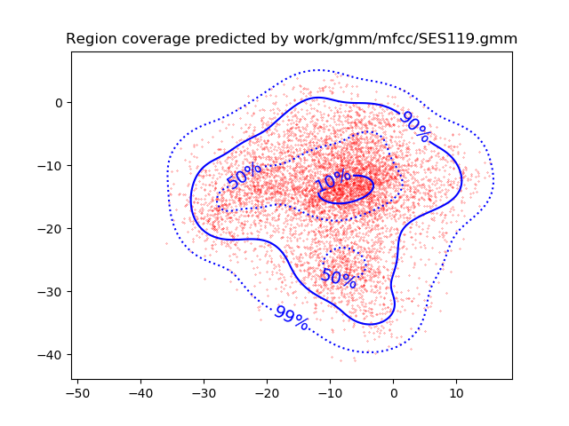

PAV - P4: reconocimiento y verificación del locutor
===================================================

Obtenga su copia del repositorio de la práctica accediendo a [Práctica 4](https://github.com/albino-pav/P4)
y pulsando sobre el botón `Fork` situado en la esquina superior derecha. A continuación, siga las
instrucciones de la [Práctica 2](https://github.com/albino-pav/P2) para crear una rama con el apellido de
los integrantes del grupo de prácticas, dar de alta al resto de integrantes como colaboradores del proyecto
y crear la copias locales del repositorio.

También debe descomprimir, en el directorio `PAV/P4`, el fichero [db_8mu.tgz](https://atenea.upc.edu/mod/resource/view.php?id=3508877?forcedownload=1)
con la base de datos oral que se utilizará en la parte experimental de la práctica.

Como entrega deberá realizar un *pull request* con el contenido de su copia del repositorio. Recuerde
que los ficheros entregados deberán estar en condiciones de ser ejecutados con sólo ejecutar:

~~~~~~~~~~~~~~~~~~~~~~~~~~~~~~~~~~~~~~~~~~~~~~~~~~~~~.sh
  make release
  run_spkid mfcc train test classerr verify verifyerr
~~~~~~~~~~~~~~~~~~~~~~~~~~~~~~~~~~~~~~~~~~~~~~~~~~~~~

Recuerde que, además de los trabajos indicados en esta parte básica, también deberá realizar un proyecto
de ampliación, del cual deberá subir una memoria explicativa a Atenea y los ficheros correspondientes al
repositorio de la práctica.

A modo de memoria de la parte básica, complete, en este mismo documento y usando el formato *markdown*, los
ejercicios indicados.

## Ejercicios.

### SPTK, Sox y los scripts de extracción de características.

- Analice el script `wav2lp.sh` y explique la misión de los distintos comandos involucrados en el *pipeline*
  principal (`sox`, `$X2X`, `$FRAME`, `$WINDOW` y `$LPC`). Explique el significado de cada una de las 
  opciones empleadas y de sus valores.

>* `sox`: Utilidad, definida por su mismo manual como una "Navaja Suiza" de la edición de audio. Permite leer, escribir y aplicar diversos efectos a archivos de audio en la mayoría de formatos populares. También permite combinar múltiples fuentes de entrada, síntesis de audio y actuar como reproductor de audio. También puede dividir una entrada de audio en diversos ficheros de audio de salida. Se aplican las siguientes opciones:
>
>
>>`-t`: Indicamos tipo de fichero de entrada
>
>>`-e`: Codificación aplicada al fichero de entrada (signed-integer)
>
>>`-b`: Bits por muestra del fichero de entrada (16 bits)
>

>* `$X2X`: Intercambio del tipo de datos
>>`Tipo entrada`: Short (16 bits, 2Bytes), lo indicamos con `+s`
>
>>`Tipo salida`: Float (32 bits, 4Bytes), lo indicamos con `+f`

>* `$FRAME`: División en tramas del archivo de entrada
>>`-l`: Tamaño de las tramas de salida (en muestras). Se aplica un tamaño de 240.
>
>>`-p`: Desplazamiento entre tramas. Nótese que el parámetro indicado aquí es menor que el tamaño de las tramas de salida; muestras consecutivas tendrán tramos solapados.

>* `$WINDOW`: Aplicar enventanamiento a las tramas de salida. Las opciones por defecto, si no se especifican, es aplicar enventanamiento Blackman con normalización de potencia
>
>* `$LPC`: Obtención de coeficientes de predicción lineal (LPC). El parámetro obtenido por el argumento `$lpc_order` permite especificar el número de coeficientes deseado.
>
>>`-m`: Número de coeficientes de predicción lineal


- Explique el procedimiento seguido para obtener un fichero de formato *fmatrix* a partir de los ficheros de
  salida de SPTK (líneas 45 a 47 del script `wav2lp.sh`).

```bash
# Our array files need a header with the number of cols and rows:
ncol=$((lpc_order+1)) # lpc p =>  (gain a1 a2 ... ap) 
nrow=`$X2X +fa < $base.lp | wc -l | perl -ne 'print $_/'$ncol', "\n";'`
```
>* `Columnas (ncol)`: Hay que considerar que el primer término será la ganancia de predicción, seguido de los coeficientes LPC, por lo que el número de columnas será el orden de predicción LPC + 1.   
>* `Filas (nrow)`: En primer lugar, usamos `X2X`  con el comando `-fa` para transformar los datos otorgados por el fichero `base.lp` de float a ASCII. Seguidamente, se cuenta el número de líneas del fichero para no depender de los solapes producidos por el enventanamiento escogido. Finalmente, se obtiene el número de filas imprimiendo un salto de línea cada vez que se obtiene un valor del fichero, y dividiéndolo por el número de columnas para compensar el efecto de que, realmente, en cada línea se obtiene el número de valores de cada una de las filas, que será exactamente igual que ncol. 


  * ¿Por qué es conveniente usar este formato (u otro parecido)? Tenga en cuenta cuál es el formato de
    entrada y cuál es el de resultado.
    
  > Es un formato muy útil ya que sin él nos sería imposible interpretar directamente el fichero. El fichero que tenemos son floats concatenados y con el formato fmatrix lo podemos ver como ASCII.


- Escriba el *pipeline* principal usado para calcular los coeficientes cepstrales de predicción lineal
  (LPCC) en su fichero <code>scripts/wav2lpcc.sh</code>:

 ``` bash
sox $inputfile -t raw -e signed -b 16 - | $X2X +sf | $FRAME -l 240 -p 80 | $WINDOW -l 240 -L 240 | $LPC -l 240 -m $lpc_order | $LPCC -m $lpc_order -M $lpcc_order > $base.lpcc
```

- Escriba el *pipeline* principal usado para calcular los coeficientes cepstrales en escala Mel (MFCC) en su
  fichero <code>scripts/wav2mfcc.sh</code>:

``` bash
sox $inputfile -t raw -e signed -b 16 - | $X2X +sf | $FRAME -l 240 -p 80 | $WINDOW -l 240 -L 240 |
$MFCC -s 8 -w 0 -l 240 -m $mfcc_order -n $filter_bank_order > $base.mfcc
```

### Extracción de características.

- Inserte una imagen mostrando la dependencia entre los coeficientes 2 y 3 de las tres parametrizaciones
  para todas las señales de un locutor.
  
  + Indique **todas** las órdenes necesarias para obtener las gráficas a partir de las señales 
    parametrizadas.
  + ¿Cuál de ellas le parece que contiene más información?
  >Pese no haber conseguido hacer el código necesario para este apartado sabemos que los coeficientes que nos dan más información son los LPCC y los MFCC ya que están más incorrelados que los LP.

  >En la gráfica de los LP se habría de apreciar una tendencia similar a una línea mientras que en los otros dos se habría de ver una mayor dispersión [es una forma gráfica de ver la correlación entre coeficientes].

- Usando el programa <code>pearson</code>, obtenga los coeficientes de correlación normalizada entre los
  parámetros 2 y 3 para un locutor, y rellene la tabla siguiente con los valores obtenidos.

  |                        | LP   | LPCC | MFCC |
  |------------------------|:----:|:----:|:----:|
  | &rho;<sub>x</sub>[2,3] |      |      |      |
  
  + Compare los resultados de <code>pearson</code> con los obtenidos gráficamente.
  
- Según la teoría, ¿qué parámetros considera adecuados para el cálculo de los coeficientes LPCC y MFCC?
>Para el LPCC se consideran adecuados:
>    + Orden del LPCC: entre **13-16** 
>
>  Para el MFCC se consideran adecuados:
>   + Número de filtros: **24-40**
>   + Número de coeficientes: **13**
### Entrenamiento y visualización de los GMM.

Complete el código necesario para entrenar modelos GMM.

- Inserte una gráfica que muestre la función de densidad de probabilidad modelada por el GMM de un locutor
  para sus dos primeros coeficientes de MFCC.

  <p align="center">

  
  </p>
  
  Hemos usado:

  ```` bash
  plot_gmm_feat -p 99,90,50,10 -g blue work/gmm/mfcc/SES119.gmm work/mfcc/BLOCK11/SES119/SA119S* --xDim 1 --yDim 0 &
  ````

- Inserte una gráfica que permita comparar los modelos y poblaciones de dos locutores distintos (la gŕafica
  de la página 20 del enunciado puede servirle de referencia del resultado deseado). Analice la capacidad
  del modelado GMM para diferenciar las señales de uno y otro.


### Reconocimiento del locutor.

Complete el código necesario para realizar reconociminto del locutor y optimice sus parámetros.

- Inserte una tabla con la tasa de error obtenida en el reconocimiento de los locutores de la base de datos
  SPEECON usando su mejor sistema de reconocimiento para los parámetros LP, LPCC y MFCC.

    |                        | LP   | LPCC | MFCC |
  |------------------------|:----:|:----:|:----:|
  | `Tasa de error:` |   11.46   |   3.57   |    0.76  |
  | `Número de errores:` |    90  |    28  |     6 |

> 

Para conseguir estos resultados hemos usado:
>
> - Para el entrenamiento se han usado **65** Gaussianas, **27** iteraciones y un THR=**1e-6**.
> - LP: 8 coeficientes
> - LPCC: 8 coeficientes LP y 14 coeficientes LPCC
> - MFCC: 16 coeficientes y 30 filtros
>


### Verificación del locutor.

Complete el código necesario para realizar verificación del locutor y optimice sus parámetros.

- Inserte una tabla con el *score* obtenido con su mejor sistema de verificación del locutor en la tarea
  de verificación de SPEECON. La tabla debe incluir el umbral óptimo, el número de falsas alarmas y de
  pérdidas, y el score obtenido usando la parametrización que mejor resultado le hubiera dado en la tarea
  de reconocimiento.

  Usando el mismo entrenamiento: **65** Gaussianas, **27** iteraciones y un THR=**1e-6**.

 |                        | Mejores resultados MFCC |
  |------------------------|:-------------------------:|
  | Umbral óptimo | 0.178811611364794 |
  | # falsas alarmas | 2/1000=0.0000 |
  | # pérdidas | 17/250=0.1520 |
  | **SCORE** | 8.6 |
 
### Test final

- Adjunte, en el repositorio de la práctica, los ficheros `class_test.log` y `verif_test.log` 
  correspondientes a la evaluación *ciega* final.

### Trabajo de ampliación.

- Recuerde enviar a Atenea un fichero en formato zip o tgz con la memoria (en formato PDF) con el trabajo 
  realizado como ampliación, así como los ficheros `class_ampl.log` y/o `verif_ampl.log`, obtenidos como 
  resultado del mismo.
